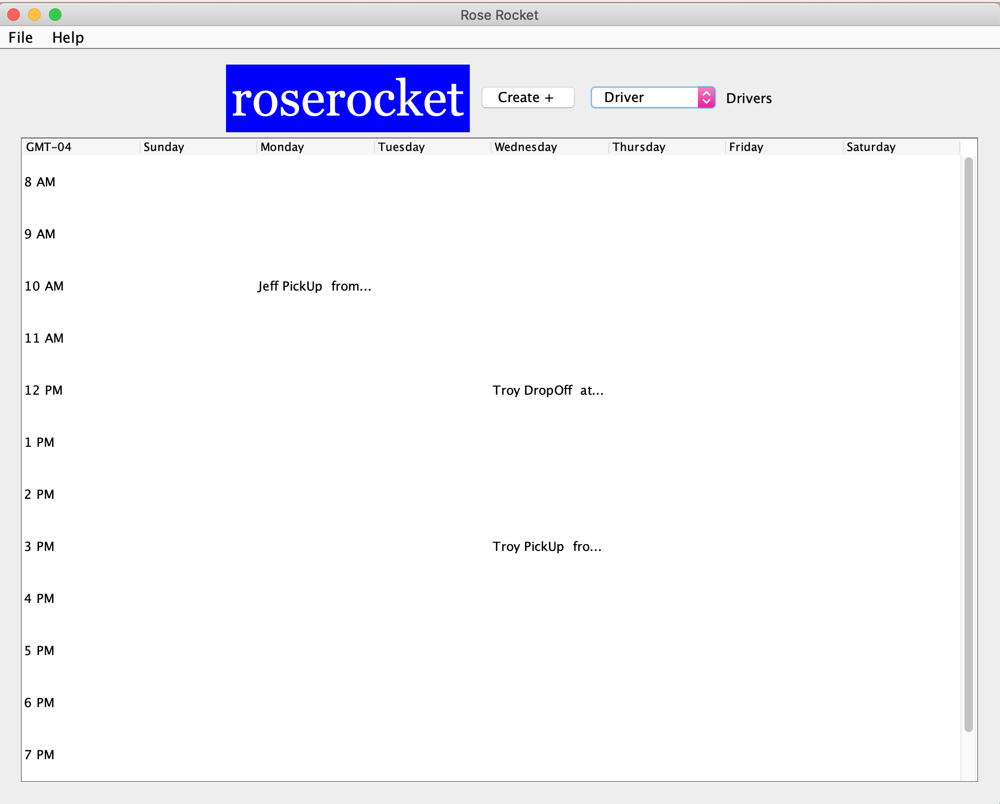

# roserocketchallenge
a basic application to manage the tasks of drivers by of where, when and what the drivers will be doing

How to run Rose Rocket GUI.
# Setup
1. Download code and ensuring to keep file name as "GUI.java"
2. Open up "Command Prompt" or "Terminal"
3. Compile and run the Java class by inputting java GUI.java
4. The application will pop up!
# Application Running
1. Application will shohw 
2. Menu bar includes "File" and "Help"   
3. Menu "File" includes Menu Items - New PickUp, New DropOff, New Driver, Delete Task * 
4. Menu "Help" includes Menu Items - Tutorial and About. * 
5. Dispatchers can create tasks by clicking the "Create +" Button  
6. When the "Create +" Button is clicked "Create Task" Pane will show up  
7. In the pop up windown -  3 fields can be completed, one ComboBox, two TextFields. 
8. Fill out the fields to populate the schedule with new tasks (Pick Up, Drop Off, Lunch, Other) * 
9. Dispatchers can view specific drivers task for the week by selecting a driver in the ComboCox *  
10. End of Application use

* Not coompleted (explanation in order) *
* Menu Items AddActionListener not completed
* MenuItem - Tuturial is not completed
* When pop up window is completed it doest update the schedule.
* Showing schedule doesnt fully work.
